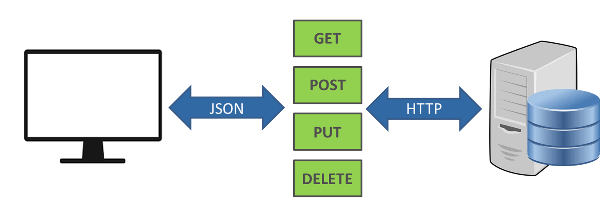

# AJAX

l'acronyme __AJAX__ signifie _asynchronous JavaScript and XML_. L'__AJAX__ combine l'utilisation du JavaScript et du [DOM](https://fr.wikipedia.org/wiki/Document_Object_Model) pour modifier l'information présentée dans le navigateur.

L'__AJAX__ permet de mettre à jour une page web de manière asynchrone en échangeant des données avec un serveur web. Cela signifie qu’il est possible de mettre à jour des parties d’une page Web, sans recharger toute la page.

## Que permet l'AJAX

L'__AJAX__ permet de :

- Lire les données d'un serveur web, et ce après qu'une page soit chargée.
- Mettre à jour une page web sans procéder à un rechargement de la page.
- Envoyer des données à un serveur web, et ce en arrière-plan.

## Le fonctionnement de l'__AJAX__

1. Un événement se produit dans une page Web (la page est chargée, un bouton est cliqué).
2. Un objet est créé par le JavaScript.
3. L’objet envoie une demande à un serveur Web.
4. Le serveur traite la demande.
5. Le serveur envoie une réponse à la page Web.
6. La réponse est lue par le JavaScript.
7. L’action appropriée (comme la mise à jour de la page) est effectuée par le JavaScript.

## Le transfert des données

Les [API REST](https://fr.wikipedia.org/wiki/Representational_state_transfer) devraient accepter le format __[JSON](https://fr.wikipedia.org/wiki/JavaScript_Object_Notation#:~:text=JavaScript%20Object%20Notation%20(JSON)%20est,le%20permet%20XML%20par%20exemple.)__ pour la demande et lors de la réception de la réponse. __JSON est la norme pour le transfert de données__. Presque toutes les technologies peuvent l’utiliser, JavaScript dispose de méthodes intégrées pour coder et décoder le __JSON__ soit via l’[API Fetch](https://developer.mozilla.org/fr/docs/Web/API/Fetch_API) ou soit par l’intermédiaire d’un autre [client HTTP](https://fr.wikipedia.org/wiki/Client_HTTP#:~:text=Un%20client%20HTTP%20est%20un,HTTP%20(Hypertext%20Transfer%20Protocol).). Les technologies côté serveur ont des bibliothèques qui peuvent décoder le __JSON__.

Il existe d’autres façons de transférer des données. [XML](https://fr.wikipedia.org/wiki/Extensible_Markup_Language) n’est pas largement pris en charge les frameworks sans transformer les données nous-mêmes en quelque chose qui peut être utilisé et c’est généralement du __JSON__. Nous ne pouvons pas manipuler ces données aussi facilement du côté du client, en particulier dans les navigateurs. Il finit par être beaucoup de travail supplémentaire juste pour faire le transfert de données.

L'__XML__ cité dans l'acronyme __AJAX__ était historiquement le moyen privilégié pour structurer les informations transmises entre le serveur web et le navigateur, de nos jours le __JSON__ tend à être le nouveau standard.

## Les différentes requêtes envers un serveur web

Une demande envers un serveur web doit être indiquée par un verbe HTTP. Les verbes __les plus courants__ incluent GET, POST, PUT et DELETE.

- __GET__ récupère des ressources.
- __POST__ soumet de nouvelles données au serveur.
- __PUT__ met à jour les données existantes.
- __DELETE__ supprime les données.



## Fetch la nouvelle API native

__Fetch__ est une nouvelle API JavaScript native, supportée par la plupart des navigateurs d'aujourd’hui. __Fetch__ vous permet de faire des requêtes similaires à __XMLHttpRequest__. Selon [Google](https://developers.google.com/web/ilt/pwa/working-with-the-fetch-api), il est plus facile avec __fetch()__ de faire des demandes asynchrones et d'en gérer les réponses qu’avec les anciennes manières.

__Fetch__ dispose dans son interface les éléments suivants :

- __fetch()__ : La méthode utilisée pour aller chercher une ressource.
- __Headers__ : Représente les en-têtes de la réponse et de la demande, vous permettant de les interroger et de prendre différentes mesures en fonction des résultats.
- __Request__ : Représente une demande de ressources.
- __Response__ : Représente la réponse à une demande.

## Récupérer des données à l'aide de __fetch()__

La fonction __fetch()__ est disponible dans l'objet global. La fonction prend un argument obligatoire qui est l'adresse vers la ressource à obtenir.

```js
fetch('https://api.github.com/users/alexis35115')
    .then((reponse) => {
        console.log(reponse);
    })
    .catch((erreur) => {
        console.log("Une erreur est survenue", erreur);
    });
```

>**Astuce :** Le [code source](../src/exemple-ajax/index.html) est disponible.

Le code ci-dessus utilise l'API Fetch pour récupérer les données de l’utilisateur "alexis35115" sur GitHub. Lorsque la promesse est résolue, nous obtenons un objet en retour. Néanmoins, si vous essayez de journaliser la réponse dans la console du navigateur, vous trouverez que nous n'avons a pas les données que nous cherchons. C’est parce qu’un objet "reponse" possède des informations sur elle-même en plus des données.


Pour obtenir les données, nous devons enchaîner une autre instruction __then()__ pour appeler la méthode __json()__.

```js
fetch('https://api.github.com/users/alexis35115')
    .then((reponse) => {
        return reponse.json();
    })
    .then((donnees) =>{
        console.log(donnees);
    })
    .catch((erreur) => {
        console.log("Une erreur est survenue", erreur);
    });
```

>**Astuce :** Le [code source](../src\exemple-ajax\index.html) est disponible.


N'hésitez pas à consulter cet [article](https://www.freecodecamp.org/news/javascript-fetch-api-tutorial-with-js-fetch-post-and-header-examples/) pour approfondir vos connaissances.

[Revenir à la page principale](../README.md)
