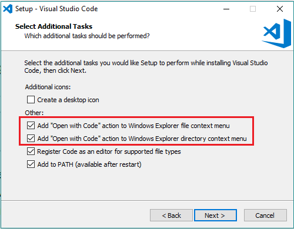

# Visual Studio Code

Selon Wikipédia, Visual Studio Code est un éditeur de code extensible développé par Microsoft pour Windows, Linux et macOS.

Les fonctionnalités incluent la prise en charge du débogage, la mise en évidence de la syntaxe, la complétion intelligente du code, les snippets, la refactorisation du code et Git intégré. Les utilisateurs peuvent modifier le thème, les raccourcis clavier, les préférences et installer des extensions qui ajoutent des fonctionnalités supplémentaires.

Le code source de Visual Studio Code provient du projet logiciel libre et open source [VSCode de Microsoft](https://github.com/microsoft/vscode) publié sous la licence MIT permissive, mais les binaires compilés sont des logiciels gratuits pour toute utilisation.

Dans le [Stack Overflow 2019 Developer Survey](https://insights.stackoverflow.com/survey/2019), Visual Studio Code a été classé comme l'outil d'environnement de développement le plus populaire, avec 50,7 % des 87 317 répondants déclarant l'utiliser.

Une vidéo expliquant l'installation et la configuration de Visual Studio Code est disponible. VIDEO À METTRE ICI.

## Installation de Visual Studio Code

1. Téléchargez l'[installateur](https://go.microsoft.com/fwlink/?LinkID=534107) pour Windows
2. Une fois le téléchargement complété, exécuter l'installateur __VSCodeUserSetup-{version}.exe__.
3. Par défaut, Visual Studio Code sera installé sous "C:\users\{username}\AppData\Local\Programs\Microsoft VS Code".

>**Important :** Assurez-vous d'avoir ces options de sélectionnées.



>**Astuce :** Lors de l'installation, votre variable `%PATH%` sera modifiée pour y ajouter Visual Studio Code. Un redémarrage sera nécessaire pour que le changement puisse prendre effet.

Vous pouvez vous référer à la [documentation officielle](https://code.visualstudio.com/docs/setup/windows) au besoin.

## Installation des extensions recommandées

Pour installer une extension dans Visual Studio Code, voici la [procédure](https://code.visualstudio.com/docs/editor/extension-gallery) à suivre. Donc, il faut installer les extensions suivantes :

- [PHP extension pack](https://marketplace.visualstudio.com/items?itemName=felixfbecker.php-pack) : regroupement d'extensions pour le développement PHP
- [sftp-sync](https://marketplace.visualstudio.com/items?itemName=liximomo.sftp) :  permet de transférer des fichiers sur le réseau via le protocol FTP
- [Open PHP/HTML/JS In Browser](https://marketplace.visualstudio.com/items?itemName=PrimaFuture.open-php-html-js-in-browser) : permet d'ouvrir le code directement dans le navigateur à l'aide du raccourci par défaut __Shift+F6__.

## Configuration des extensions

Suite à l'installation des extensions, il faut savoir comment [paramétrer les extensions](https://code.visualstudio.com/docs/getstarted/settings).

Ensuite, il faut procéder à quelques configurations :

- Définir l'exécutable de PHP : dans la section __Extensions__ du menu __Settings__, il faut ouvrir __php__ et aller éditer le fichier "settings.json". Dans le fichier de configuration, ajoutez ces valeurs :

```json
"php.executablePath": "C:\\Bitnami\\wampstack\\php\\php.exe",
"php.validate.executablePath": "C:\\Bitnami\\wampstack\\php\\php.exe"
```

- Pour configurer __Open PHP/HTML/JS__, allez dans le menu __Extensions__ -> __Open PHP/HTML/JS__, ajoutez la valeur "<http://localhost:8888/${fileBasename}>". Dans la configuration __Custom Url to Open__, insérez la valeur __"C:\Bitnami\wampstack\apache2\htdocs"__ dans la configuration __Document Root Folder__.

[Revenir à la page principale de la section](README.md)
