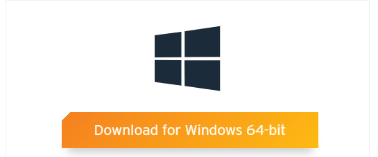
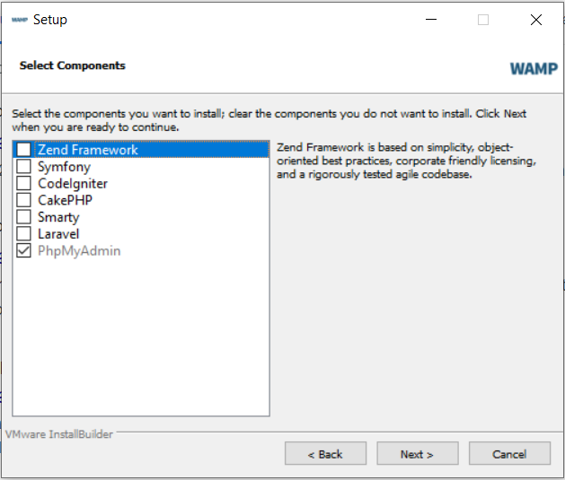
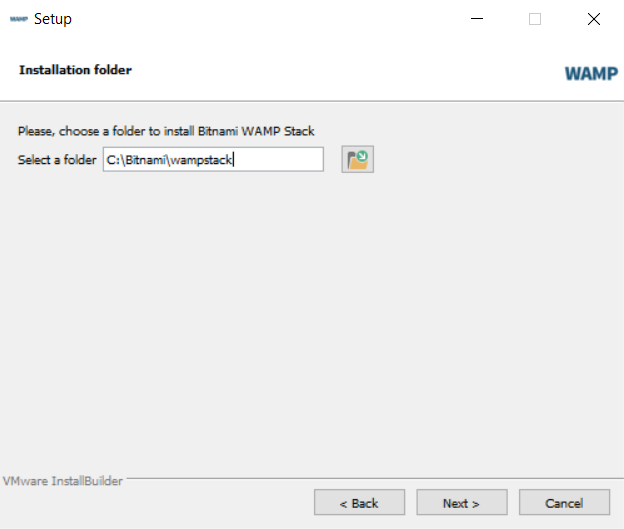
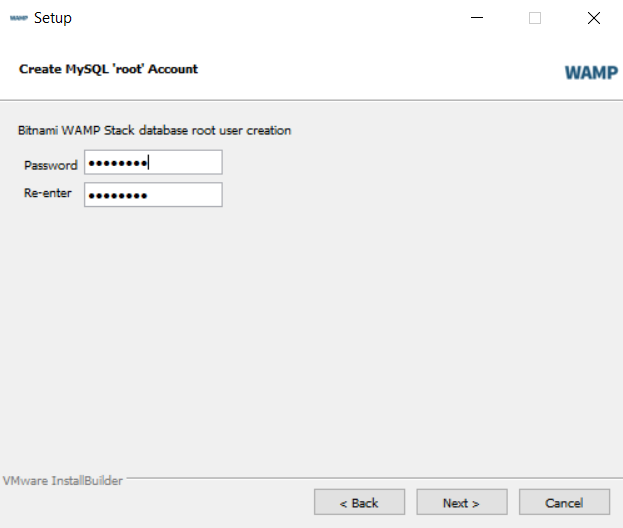
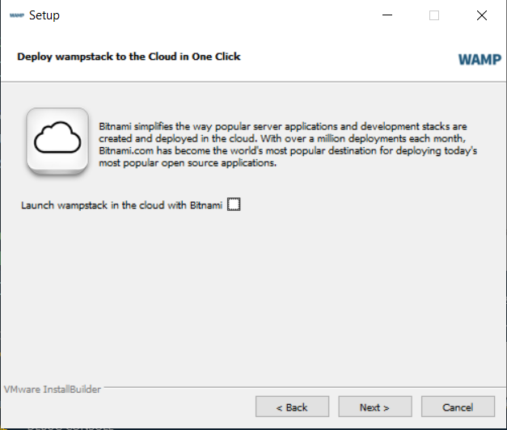
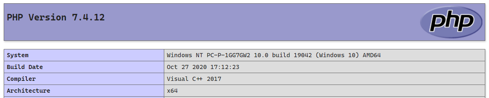

# Bitnami WAMP Stack

[Bitnami WAMP Stack](https://bitnami.com/stack/wamp) fournis un environnement de développement WAMP complet, entièrement intégré et prêt à fonctionner. Outre PHP, MySQL et Apache, il inclut également phpMyAdmin.

Une vidéo expliquant l'installation et la configuration de Bitnami WAMP Stack est disponible. VIDEO À METTRE ICI.

## Téléchargement et installation

Pour installer Bitnami, allez [ici](https://bitnami.com/stack/wamp/installer) et cliquez sur _Download for Windows_.



Une fenêtre de connexion s'affichera, cliquez suite _No thanks, just take me to the download_ pour lancer le téléchargement.


## Installation

Lorsque le téléchargement est complété, lancez l'installateur.

Lors de l'installation, vous aurez à choisir les composants à installer, assurez-vous que __PhpMyAdmin__ est sélectionné. Notez que si vous n'avez pas besoin des autres composants, vous n'avez qu'à désélectionner ces options.



Vous devez préciser le dossier d'installation de Bitnami, utiliser la valeur __C:\Bitnami\wampstack__.



Vous aurez à saisir un mot de passe pour l'utilisateur __root__ de la base de données. Assurez-vous de saisir un mot de passe et de __prendre celui-ci en note__!



Faire attention à __ne pas__ sélectionner _Launch wampstack in the cloud with Bitnami_.



## Configuration de son environnement

Suite à l'installation, Bitnami devrait s'installer sous le répertoire __C:\Bitnami__.

Voici certaines manipulations à effectuer :

- Créer un raccourci du répertoire __htdocs__ qui se trouve sous __C:\Bitnami\wampstack\apache2__ et mettre ce raccourci à la racine de Bitnami __C:\Bitnami__.
- Dans le répertoire __htdocs__, créez un répertoire __bitnami__ et y insérer le contenu de base du répertoire __htdocs__ à l'intérieur. Vous devriez être en mesure de consulter la page de Bitnami à l'adresse <http://localhost:81/bitnami/>.
- Dans le but de faciliter le développement en local, il vous faut désactiver le __cache__ par défaut. Lorsque le cache est activé, les modifications à vos applications ne seront pas immédiatement reflétées dans vos applications. Ouvrez le fichier __C:\Bitnami\wampstack\php\php.ini__ et changez la configuration __opcache.enable__ pour lui donner la valeur de __0__ (désactivé) au lieu de __1__ (activé), n'oubliez pas d'enregistrer le fichier avant sa fermeture.

## Première utilisation

Créons un répertoire __exemple__ dans le répertoire __htdocs__. Dans ce répertoire, créez un fichier __index.php__ et y insérer le code suivant :

``` php
<?php
    phpinfo();
?>
```

Vous devriez maintenant être en mesure de naviguer à l'adresse : <http://localhost:81/exemple/index.php> et vous devriez voir  les informations sur la configuration de PHP.



[Revenir à la page principale de la section](README.md)
