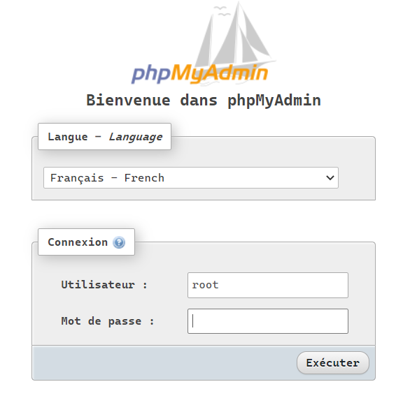
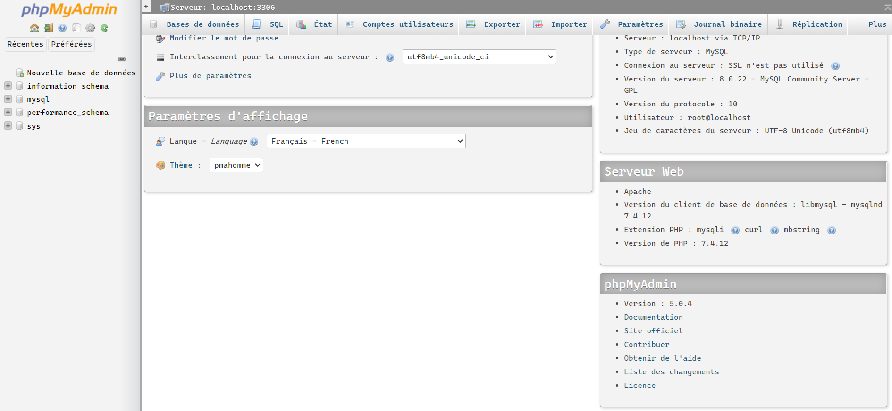

# phpMyAdmin

Selon Wikipédia, phpMyAdmin est l'une des plus célèbres interfaces pour gérer une base de données MySQL sur un serveur PHP. De nombreux hébergeurs, gratuits comme payants, le proposent ce qui évite à l'utilisateur d'avoir à l'installer.

Cette interface pratique permet d'exécuter, très facilement et sans grandes connaissances en bases de données, des requêtes comme les créations de table de données, insertions, mises à jour, suppressions et modifications de structure de la base de données, ainsi que l'attribution et la révocation de droits et l'import/export. Ce système permet de sauvegarder commodément une base de données sous forme de fichier .sql et d'y transférer ses données, même sans connaître SQL.

Les requêtes SQL restent possibles, ce qui permet de les tester interactivement lors de la création d'un site pour les utiliser ensuite en batch (c'est-à-dire en différé) une fois au point.

>**Astuce** - Une [vidéo](https://youtu.be/M1ziUTiK1fY) expliquant la connexion initiale est disponible.

## Configuration initiale

Par défaut, lors de l'installation de Bitnami WAMP Stack, celui-ci installe phpMyAdmin par défaut. Pour y accéder, naviguez à l'adresse : <http://localhost/phpmyadmin/>.

Pour vous connecter, utilisez __root__ comme l'utilisateur et utilisez le mot de passe que vous avez saisi lors de l'installation de Bitnami WAMP Stack.

[Revenir à la page principale de la section](README.md)
