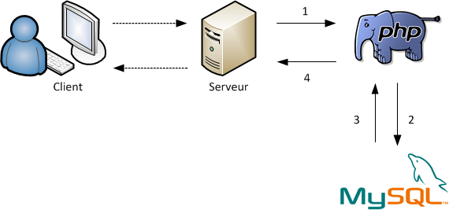

# Interaction avec la base de données

Cette section couvre les notions SQL ainsi que l'interaction depuis le PHP.

## À quel moment mon site web a besoin d'une base de données

Les bases de données peuvent contenir un large éventail d’informations, comme :

- Articles
- Photos
- Vidéos
- Questions
- Réponses
- Les informations d'un usager
- Etc

Si un site web peut fournir un large éventail d’informations, et ce efficacement, il devient beaucoup plus utile qu’une simple page web statique.

Les bases de données sont également utilisées pour stocker la structure des pages Web elles-mêmes, pas seulement le contenu.

Une demande à un site Web se résume ainsi :

- Le serveur reçoit la demande
- Le serveur demande à la logique d'affaires d'analyser la demande
- La logique d'affaires va, au besoin, récupérer de l'information dans la base de données
- Le serveur met le tout ensemble dans une page Web et envoie la page au navigateur.

Ce processus résume ce qu’on appelle le cycle de demande/réponse HTTP. Et cela peut se produire des milliers de fois par minute selon l'achalandage.

C’est pour cette raison que Facebook, Google et autres ont besoin de ces _data center_ avec beaucoup, __beaucoup de serveurs__, de stockage et de connexions haute capacité.

## Mise en route

Voici les étapes à suivre :

- [Les notions SQL](notions-sql.md)
- [Les normes SQL](normes-sql.md)
- [Initialiser une connexion à la base de données](initialiser-connexion-bd.md)
- [Récupérer des données de la base de données](recuperer-donnees-bd.md)
- [Insérer des données dans la base de données](inserer-donnees-bd.md)
- [Modifier des données dans la base de données](modifier-donnees-bd.md)
- [Supprimer des données dans la base de données](supprimer-donnees-bd.md)

[Revenir à la page principale](../README.md)
