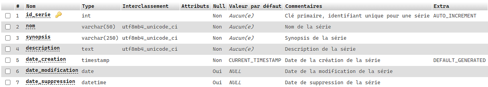
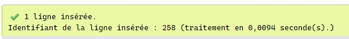
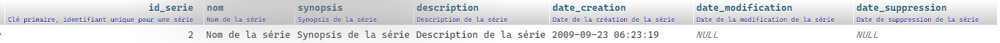

# Insérer des données dans la base de données

__INSERT INTO__ est utilisée pour créer des données dans les tables de la base de données. La commande INSERT crée une nouvelle ligne dans la table pour en conserver les données. Les données sont généralement fournies par des programmes qui s’exécutent par dessus la base de données.

## Syntaxe de base

Examinons la syntaxe de base de la commande INSERT INTO :

```sql
INSERT INTO nom_table (colonne_1, colonne_2, ...)
               VALUES (valeur_1, valeur_2, ...);
```

- __INSERT INTO nom\_table__ - Est la commande qui indique au serveur de base de données d’ajouter une nouvelle ligne dans une table nommée _nom\_table_.
- __(colonne_1, colonne_2, ...)__ - Spécifie les colonnes à renseigner lors de la création.
- __VALUES (valeur_1, valeur_2, ...)__ - Précise les valeurs à ajouter dans la nouvelle ligne.

Lorsqu'on fournit les valeurs à insérer dans un nouvel enregistrement, les éléments suivants doivent être pris en considération :

- __Les données de type texte__ - Doivent être incluses dans des guillemets simples.
- __Les données de type numérique__ - Doivent être fournies directement et sans les entourer de guillemets simples ou doubles.
- __Les données de type date__ - Doivent être entre des guillemets simples dans un format tel que 'YYYY-MM-DD'.

>**Note :** Au besoin, référez-vous à la [documentation](https://dev.mysql.com/doc/refman/8.0/en/data-types.html) au sujet des différents types.

## Créer ma première donnée

À l'aide de phpMyAdmin, nous allons insérer notre premier enregistrement. Avant de procéder à l'insertion dans la base de données, regardons la structure de la table _serie_.



>**Remarque :** Le champ _id\_serie_ possède l'attribut __[AUTO_INCREMENT](https://dev.mysql.com/doc/refman/8.0/en/example-auto-increment.html)__ pour générer automatiquement un identifiant unique lors de la création d'un nouvel enregistrement. Pour cette raison, il est recommandé de déléguer la généreration l'identifiant unique à la base de données.

>**Astuce :** Le [script](../src/exemple-interaction-bd/creation-table-serie.sql) pour la création de la table _serie_ est disponible.

Analysons de plus près les valeurs de la nouvelle série à créer :

| Champ | Valeur | Remarque |
|---|---|---|
| nom | 'Nom de la série' | Le nom de la série doit être entouré de guillemets |
| synopsis | 'Synopsis de la série' | Le synopsis de la série doit être entouré de guillemets |
| description | 'Description de la série' | La description de la série doit être entourée de guillemets |
| date_creation | '2009-09-23 06:23:19' | Le format de la date de création est 'YYYY-MM-DD HH:MM:SS' |
| date\_modification | NULL | Lors de l'utilisation de _NULL_, il ne faut pas entourer la valeur de guillemets |
| date\_suppression | NULL | Lors de l'utilisation de _NULL_, il ne faut pas entourer la valeur de guillemets |

```sql
INSERT INTO serie (nom,
                   synopsis,
                   description,
                   date_creation,
                   date_modification,
                   date_suppression)
           VALUES ('Nom de la série',
                   'Synopsis de la série',
                   'Description de la série',
                   '2009-09-23 06:23:19',
                    NULL,
                    NULL);
```

Voici le message de confirmation, notez que l'identifiant de la série préalablement créé est affiché à l'écran.



## Créer une donnée avec PHP à l'aide de PDO

Cette fois, nous allons procéder à la création d'une série, mais à partir de PHP avec PDO.

```php
<?php
$dsn = 'mysql:dbname=demo_acces_donnees;host=localhost';
$utilisateur = 'root';
$motPasse = 'admin123';

try {
    // Créer la connexion
    $dbh = new PDO($dsn, $utilisateur, $motPasse);
    $dbh->setAttribute(PDO::ATTR_ERRMODE, PDO::ERRMODE_EXCEPTION);
    $dbh->exec('SET CHARACTER SET UTF8');

    // Valeur de la série à créer
    $nom = "Nom de la série";
    $synopsis = "Synopsis de la série";
    $description = "Description de la série";
    $dateCreation = "2009-09-23 06:23:19";
    $dateModification = NULL;
    $dateSuppression = NULL;

    // Requête INSERT pour la création de la nouvelle série
    $requeteAjoutSerie = "INSERT INTO serie (nom, synopsis, description, date_creation, date_modification, date_suppression)
                                     VALUES (:nom, :synopsis, :description, :date_creation, :date_modification, :date_suppression)";

    $sth = $dbh->prepare($requeteAjoutSerie);

    $sth->bindParam(':nom', $nom, PDO::PARAM_STR);
    $sth->bindParam(':synopsis', $synopsis, PDO::PARAM_STR);
    $sth->bindParam(':description', $description, PDO::PARAM_STR);
    $sth->bindParam(':date_creation', $dateCreation, PDO::PARAM_STR);
    $sth->bindParam(':date_modification', $dateModification, PDO::PARAM_STR);
    $sth->bindParam(':date_suppression', $dateSuppression, PDO::PARAM_STR);
    $sth->execute();

    /*
    À l'aide de la méthode "lastInsertId()" de PDO, il est possible de récupérer l'identifiant unique de la série créée (id_serie).

    Au besoin, référez-vous à cette question sur StackOver Flow https://www.facebook.com/PawnStars/videos/483626918952135.
    */
    echo($dbh->lastInsertId());

} catch (PDOException $e) {
    echo('Échec lors de la connexion : ' . $e->getMessage());
}
?>
```

>**Note :** L'utilisation de __PDO::PARAM_STR__ lors de l'association à un champ de type date.

À l'aide de l'identifiant unique (_id\_serie_) affiché à l'écran, provenant de lastInsertId(), il est possible de rechercher la nouvelle série créée :


Au besoin, référez-vous à la [documentation officielle](https://dev.mysql.com/doc/refman/8.0/en/insert.html).

[Revenir à la page principale de la section](README.md)
