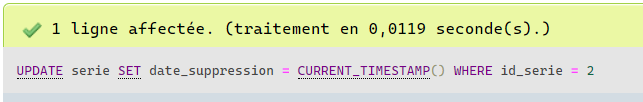
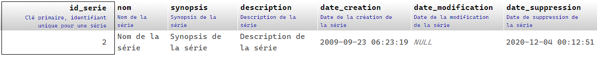
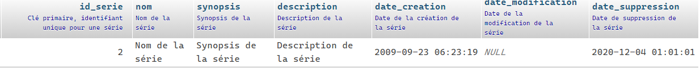

# Modifier des données dans la base de données

La commande __UPDATE__ est utilisée pour modifier les données dans une table de la base de données. La commande de mise à jour peut être utilisée pour mettre à jour un seul champ ou plusieurs champs en même temps.

## Syntaxe de base

Examinons la syntaxe de base de la commande UPDATE :

```sql
UPDATE nom_table
   SET nom_colonne = nouvelle_valeur
[WHERE condition];
```

- __UPDATE nom_table__ - Est la commande qui indique à la base de données de mettre à jour des données de la table.
- __SET nom_colonne = nouvelle\_valeur__ - Est la combinaison de noms et de valeurs des champs affectés par la mise à jour.
- __[WHERE condition]__ - Est facultative et peut être utilisée pour appliquer un filtre qui restreint le nombre de lignes affectées par la mise à jour.

Lorsqu'on renseigne les valeurs pour une mise à jour d'un enregistrement, les éléments suivants doivent être pris en considération :

- __Les données de type texte__ - Doivent être incluses dans des guillemets simples.
- __Les données de type numérique__ - Doivent être fournies directement et sans les entourer de guillemets simples ou doubles.
- __Les données de type date__ - Doivent être entre des guillemets simples dans un format tel que 'YYYY-MM-DD'.

>**Note :** Au besoin, référez-vous à la [documentation](https://dev.mysql.com/doc/refman/8.0/en/data-types.html) au sujet des différents types.

## Modifier ma première donnée

À l'aide de phpMyAdmin, nous allons modifier notre premier enregistrement. Avant de procéder à la modification, regardons la structure de la table _serie_.


>**Remarque :** Le champ _id\_serie_ possède l'attribut __[AUTO_INCREMENT](https://dev.mysql.com/doc/refman/8.0/en/example-auto-increment.html)__ pour générer automatiquement un identifiant unique lors de la création d'un nouvel enregistrement. __Soyez prudent à ne pas changer ce numéro à moins d'être certain de votre action__.

>**Astuce :** Le [script](../src/exemple-interaction-bd/creation-table-serie.sql) pour la création de la table _serie_ est disponible.

Analysons de plus près les valeurs à utiliser pour la mise à jour de la série ayant pour identifiant (_id\_serie_) la valeur de __2__ :

| Champ | Valeur | Remarque |
|---|---|---|
| date\_suppression | CURRENT\_TIMESTAMP() | Renvoie la date et l’heure actuelles dans le format 'YYYY-MM-DD HH:MM:SS' |

```sql
UPDATE serie
   SET date_suppression = CURRENT_TIMESTAMP()
 WHERE id_serie = 2;
```

Voici le message de confirmation :



Regardons de plus près la série modifiée :

```sql
SELECT *
  FROM serie
 WHERE id_serie = 2;
```



>**Remarque :** Notez que les autres champs de l'enregistrement sont restés inchangés suite à la mise à jour, car seul le champ _date\_suppression_ était inclus dans la déclaration __SET__.

## Modifier une donnée avec PHP à l'aide de PDO sans l'utilisation de bindParam

Cette fois, nous allons procéder à la mise à jour d'une série, mais à partir de PHP avec PDO et __sans l'utilisation de bindParam__.

```php
<?php
    $dsn = 'mysql:dbname=demo_acces_donnees;host=localhost';
    $utilisateur = 'root';
    $motPasse = 'admin123';

    try {
        // Créer la connexion
        $dbh = new PDO($dsn, $utilisateur, $motPasse);
        $dbh->setAttribute(PDO::ATTR_ERRMODE, PDO::ERRMODE_EXCEPTION);
        $dbh->exec('SET CHARACTER SET UTF8');

        // Requête UPDATE pour la mise à jour d'une série
        $requeteMiseAJourSerie = "UPDATE serie
                                    SET date_suppression = '2020-12-04 01:01:01'
                                  WHERE id_serie = 2";

        $sth = $dbh->prepare($requeteMiseAJourSerie);
        $sth->execute();

    } catch (PDOException $e) {
        echo('Échec lors de la connexion : ' . $e->getMessage());
    }
?>
```

À l'aide de phpMyAdmin, il est possible de confirmer la mise à jour de la série.

## Modifier une donnée avec PHP à l'aide de PDO avec l'utilisation de bindParam

Cette fois, nous allons procéder à la mise à jour d'une série, mais à partir de PHP avec PDO et __avec l'utilisation de bindParam__.

```php
<?php
    $dsn = 'mysql:dbname=demo_acces_donnees;host=localhost';
    $utilisateur = 'root';
    $motPasse = 'admin123';

    try {
        // Créer la connexion
        $dbh = new PDO($dsn, $utilisateur, $motPasse);
        $dbh->setAttribute(PDO::ATTR_ERRMODE, PDO::ERRMODE_EXCEPTION);
        $dbh->exec('SET CHARACTER SET UTF8');

        // Informations de la série
        $dateSuppression = '2020-12-04 01:01:01';
        $idSerie = 2;

        // Requête UPDATE pour la mise à jour d'une série
        $requeteMiseAJourSerie = "UPDATE serie
                                    SET date_suppression = :date_suppression
                                  WHERE id_serie = :id_serie";

        $sth = $dbh->prepare($requeteMiseAJourSerie);

        $sth->bindParam(':date_suppression', $dateSuppression, PDO::PARAM_STR);
        $sth->bindParam(':id_serie', $idSerie, PDO::PARAM_INT);
        $sth->execute();

    } catch (PDOException $e) {
        echo('Échec lors de la connexion : ' . $e->getMessage());
    }
?>
```

>**Note :** L'utilisation de __PDO::PARAM_STR__ lors de l'association à un champ de type date.

À l'aide de phpMyAdmin, il est possible de confirmer la mise à jour de la série :


Au besoin, référez-vous à la [documentation officielle](https://dev.mysql.com/doc/refman/8.0/en/update.html).

[Revenir à la page principale de la section](README.md)
