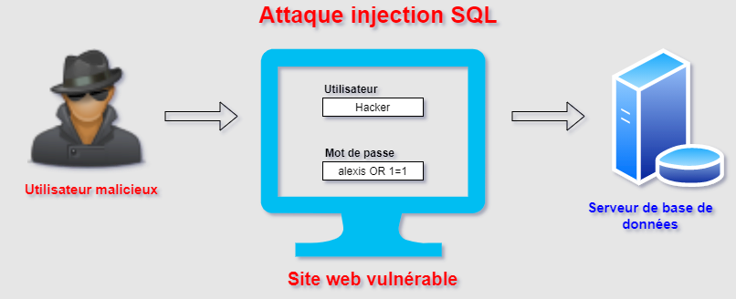
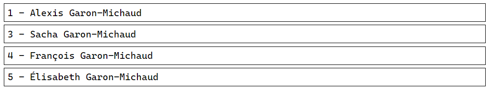

# Récupérer des données à partir de la base de données

Dans cette section, nous allons couvrir la récupération de données à partir d'une base de données MySQL et ce à l'aide de PHP.

>**Astuce :** Le [script de création](../src/exemple-interaction-bd/demo_acces_donnees.sql) de la base de données cible pour la démonstration est disponible.

## Récupérer mes premières données

L’instruction SELECT est utilisée pour sélectionner des données à partir d’une ou plusieurs tables :

```sql
SELECT nom_colonne(s)
  FROM nom_table
```

Ou nous pouvons utiliser le caractère __*__ pour sélectionner __TOUTES__ les colonnes à partir d’une table cible :

```sql
SELECT *
  FROM nom_table
```

>**Astuce :** Il est une bonne pratique de préalablement valider notre requête SQL via l'interface de phpMyAdmin avant d'intégrer celle-ci dans notre code.

### Utiliser PDO et fetchAll() pour récupérer des données

La fonction fetchAll(), retourne un tableau associatif contenant toutes les lignes du jeu d'enregistrements. Le tableau représente chaque ligne comme soit un tableau de valeurs des colonnes, soit un objet avec des propriétés correspondant à chaque nom de colonne.

L'utilisation de cette méthode pour récupérer de gros jeux de résultats peut augmenter les ressources du système, mais également ces ressources. Plutôt que de récupérer toutes les données et de les manipuler avec PHP, utilisez la base de données pour manipuler les jeux de résultats. Par exemple, utilisez les clauses WHERE et ORDER BY dans vos requêtes SQL pour restreindre les résultats avant de les récupérer et de les traiter avec PHP.

L'exemple suivant sélectionne les colonnes _id\_utilisateur_, _prenom_ et _nom_ de la table _utilisateur_ pour ensuite afficher les données :

```php
<?php
$dsn = 'mysql:dbname=demo_acces_donnees;host=localhost';
$utilisateur = 'root';
$motPasse = 'admin123';

try {
    // Instanciation de la connexion
    $dbh = new PDO($dsn, $utilisateur, $motPasse);

    // Définir le mode d'erreur
    $dbh->setAttribute(PDO::ATTR_ERRMODE, PDO::ERRMODE_EXCEPTION);

    // Définir l'encodage
    $dbh->exec('SET CHARACTER SET UTF8');

    // Préparer la requête à exécuter
    $sth = $dbh->prepare("SELECT id_utilisateur, nom, prenom FROM utilisateur;");

    // Exécution de la requête
    $sth->execute();

    // Récupérer tous les utilisateurs provenant de l'exécution de la requête
    $utilisateurs = $sth->fetchAll();

    // Afficher les informations des utilisateurs à l'écran
    echo("<pre>");
    print_r($utilisateurs);
    echo("</pre>");

} catch (PDOException $e) {
    echo('Échec lors de la connexion : ' . $e->getMessage());
}
?>
```

Affichage à l'écran :

```txt
Array
(
    [0] => Array
        (
            [id_utilisateur] => 1
            [0] => 1
            [nom] => Garon-Michaud
            [1] => Garon-Michaud
            [prenom] => Alexis
            [2] => Alexis
        )

    [1] => Array
        (
            [id_utilisateur] => 3
            [0] => 3
            [nom] => Garon-Michaud
            [1] => Garon-Michaud
            [prenom] => Sacha
            [2] => Sacha
        )

    [2] => Array
        (
            [id_utilisateur] => 4
            [0] => 4
            [nom] => Garon-Michaud
            [1] => Garon-Michaud
            [prenom] => François
            [2] => François
        )

    [3] => Array
        (
            [id_utilisateur] => 5
            [0] => 5
            [nom] => Garon-Michaud
            [1] => Garon-Michaud
            [prenom] => Élisabeth
            [2] => Élisabeth
        )

    [4] => Array
        (
            [id_utilisateur] => 6
            [0] => 6
            [nom] => Michaud
            [1] => Michaud
            [prenom] => Laurianne
            [2] => Laurianne
        )

)
```

### Utiliser PDO et fetch() pour récupérer un usager spécifique

La fonction fetch(), récupère une ligne depuis un jeu de résultats associé à l'objet PDOStatement.

La valeur retournée par cette fonction en cas de succès dépend du type récupéré. Dans tous les cas, FALSE est retourné si une erreur survient.

L'exemple suivant sélectionne les colonnes _id\_utilisateur_, _prenom_ et _nom_ de la table _utilisateur_ où la colonne _id\_utilisateur_ est égale à __1__, pour ensuite afficher les données :

```php
<?php
$dsn = 'mysql:dbname=demo_acces_donnees;host=localhost';
$utilisateur = 'root';
$motPasse = 'admin123';

try {
    // Instanciation de la connexion
    $dbh = new PDO($dsn, $utilisateur, $motPasse);

    // Définir le mode d'erreur
    $dbh->setAttribute(PDO::ATTR_ERRMODE, PDO::ERRMODE_EXCEPTION);

    // Définir l'encodage
    $dbh->exec('SET CHARACTER SET UTF8');

    // Préparer la requête à exécuter
    $sth = $dbh->prepare("SELECT id_utilisateur, nom, prenom FROM utilisateur WHERE id_utilisateur = 1;");

    // Exécution de la requête
    $sth->execute();

    // Récupérer l'utilisateur provenant de l'exécution de la requête
    $utilisateur = $sth->fetch();

    // Afficher les informations de l'utilisateur à l'écran
    echo("<pre>");
    print_r($utilisateur);
    echo("</pre>");

} catch (PDOException $e) {
    echo('Échec lors de la connexion : ' . $e->getMessage());
}
?>
```

Affichage à l'écran :

```txt
Array
(
    [id_utilisateur] => 1
    [0] => 1
    [nom] => Garon-Michaud
    [1] => Garon-Michaud
    [prenom] => Alexis
    [2] => Alexis
)
```

## Injection SQL

L'injection SQL (en anglais _SQL Injection_) est un type d’attaque d’injection qui permet d’exécuter des instructions SQL malveillantes. Les attaquants peuvent utiliser les vulnérabilités d’injection SQL pour contourner les mesures de sécurité de l’application. Ils peuvent contourner l’authentification et l’autorisation d’une page Web ou d’une application Web et récupérer le contenu de l’ensemble de la base de données. Ils peuvent également utiliser de l'injection SQL pour ajouter, modifier et supprimer des enregistrements dans la base de données.

Une vulnérabilité d’injection SQL peut affecter n’importe quel site Web ou application Web qui utilise une base de données SQL telle que MySQL, Oracle, SQL Server ou autres. Les utilisateurs malveillants peuvent les utiliser pour obtenir un accès non autorisé à vos données sensibles :

- Informations sur les clients
- Données personnelles
- Secrets commerciaux
- Données bancaires
- Autres

Les attaques d’injection SQL sont l’une des vulnérabilités d’applications Web les plus anciennes, les plus répandues et __les plus dangereuses__.



>**Note :** w3schools possède une [page dédiée](https://www.w3schools.com/sql/sql_injection.asp) sur le sujet.

### Comment et pourquoi une attaque d’injection SQL est-elle effectuée

Pour effectuer une attaque d’injection SQL, un attaquant doit d’abord trouver des entrées utilisateur vulnérables dans la page Web ou l’application Web. Une page Web ou une application Web qui a une vulnérabilité d’injection SQL utilise ces entrées utilisateur directement dans une requête SQL. L’attaquant peut créer du contenu d’entrée. Ce contenu est souvent appelé une charge utile malveillante et est l’élément clé de l’attaque. Une fois que l’attaquant envoie ce contenu, des commandes SQL malveillantes sont exécutées dans la base de données.

Le SQL est un langage qui a été conçu pour gérer les données stockées dans des bases de données relationnelles. Vous pouvez l’utiliser pour accéder, modifier et supprimer des données. De nombreuses applications Web et sites Web stockent toutes les données dans les bases de données SQL. Dans certains cas, vous pouvez également utiliser les commandes SQL pour exécuter des commandes de système d’exploitation. Par conséquent, __une attaque d’injection SQL réussie peut avoir de très graves conséquences__.

- Les attaquants peuvent utiliser de l'injection SQL pour trouver les informations d’identification d’autres utilisateurs dans la base de données. Ils peuvent alors usurper l’identité de ces utilisateurs. L’utilisateur usurpé peut être un __administrateur de base de données avec tous les privilèges de la base de données__.
- Le SQL vous permet de sélectionner les données de la base de données. Une vulnérabilité d’injection SQL pourrait permettre à l’attaquant d’accéder à toutes les données d’un serveur de base de données.
- Le SQL vous permet également de modifier les données d’une base de données et d’ajouter de nouvelles données. Par exemple, avec le site Web d'une banque, un attaquant peut utiliser de l'injection SQL pour modifier les soldes, annuler des transactions ou transférer de l’argent sur son compte.
- Vous pouvez utiliser le SQL pour supprimer des enregistrements d’une base de données, voire supprimer des tables. Même si l’administrateur effectue des sauvegardes de base de données, la suppression des données peut affecter la disponibilité de l’application jusqu’à ce que la base de données soit restaurée. En outre, les sauvegardes peuvent ne pas couvrir les données les plus récentes.

### Exemple simple d'injection SQL

Voici comment un attaquant peut utiliser une vulnérabilité d’injection SQL pour contourner la sécurité d'une application et s'authentifier en tant qu’administrateur.

Le __code suivant est le pseudocode__ exécuté sur un serveur Web. Il s’agit d’un exemple simple d’authentification avec un nom d’utilisateur et un mot de passe.

```php

# Obtenir les informations envoyées par le navigateur au serveur web
idUtilisateur = requete.POST['idUtilisateur']
motPasse = requete.POST['motPasse']

# Structure de la requête vulnérable
sql = "SELECT id_utilisateur FROM utilisateur WHERE id_utilisateur '" + idUtilisateur + "' AND mot_passe = '" + motPasse + "'"

# Exécution de la requête SQL
bd.execute(sql)

```

Ces champs d’entrée sont vulnérables à l’injection SQL. Un attaquant peut utiliser les commandes SQL dans l’entrée d’une manière qui modifierait l'instruction SQL exécutée par le serveur de base de données. Par exemple, l'attaquant pourrait utiliser un truc impliquant une seule citation et définir le champ _mot\_passe_ à _'OR 1=1#_:

Par conséquent, le serveur de base de données exécute la requête SQL suivante :

```SQL
SELECT id_utilisateur
  FROM utilisateur
 WHERE id_utilisateur = 'idUtilisateur'
   AND mot_passe = ''OR 1=1#'
```

En raison de la déclaration __'OR 1=1#__, la clause __WHERE__ renvoie tous les utilisateurs de la table, peu importe l'identifiant utilisateur et son mot de passe!

### Comment prévenir une injection SQL

La seule manière sûre de se protéger des attaques d’injection SQL est la validation des valeurs à l'entrée et l'utilisation des requêtes paramétrées, y compris les instructions préparées. __Le code d'une application ne doit jamais utiliser les valeurs à l'entrée directement__. Le développeur doit [assainir](https://www.larousse.fr/dictionnaires/francais/assainir/5771) toutes les entrées, et pas seulement les entrées de formulaire Web telles que les formulaires de connexion. Ils doivent supprimer les éléments malveillants potentiels du code tels que les guillemets simples. C’est également très important de ne pas afficher les erreurs de la base de données pour les sites de production. Les erreurs retournées par la base de données peuvent être utilisées avec de l'injection SQL pour obtenir des informations sur votre base de données.

>**Astuce :** Si vous voulez en apprendre plus sur le sujet, effectuez cette [lecture](https://kinsta.com/fr/blog/injections-sql/).

## Récupérer des données à partir d'une requête paramétrée

Les requêtes préparées PDO fonctionnent comme ceci :

- Préparez une requête SQL avec des valeurs vides en tant que _placeholders_ avec un nom de variable avec un __:__ qui la précède.
- Lier des valeurs aux _placesholders_
- Exécuter la requête

Voici un exemple d'utilisation d'une requête préparée avec un _placeholder_, dans le cas présent, le paramètre sera _:id_ et aura la valeur de _1_ :

```php
<?php
$dsn = 'mysql:dbname=demo_acces_donnees;host=localhost';
$utilisateur = 'root';
$motPasse = 'admin123';

try {
    // Créer la connexion
    $dbh = new PDO($dsn, $utilisateur, $motPasse);
    $dbh->setAttribute(PDO::ATTR_ERRMODE, PDO::ERRMODE_EXCEPTION);
    $dbh->exec('SET CHARACTER SET UTF8');

    $idUtilisateur = 1;

    // Requête SQL à exécuter, notez la présence du paramètre ":id"
    $requeteObtenirUtilisateur = "SELECT id_utilisateur, nom, prenom FROM utilisateur WHERE id_utilisateur = :id";

    $sth = $dbh->prepare($requeteObtenirUtilisateur);

    // Préciser la valeur ainsi que le type du paramètre ":id"
    $sth->bindParam(':id', $idUtilisateur, PDO::PARAM_INT);
    $sth->execute();
    $utilisateur = $sth->fetch();

    // Afficher les informations de l'utilisateur à l'écran
    echo("<pre>");
    print_r($utilisateur);
    echo("</pre>");

} catch (PDOException $e) {
    echo('Échec lors de la connexion : ' . $e->getMessage());
}
?>
```

Affichage à l'écran :

```txt
Array
(
    [id_utilisateur] => 1
    [0] => 1
    [nom] => Garon-Michaud
    [1] => Garon-Michaud
    [prenom] => Alexis
    [2] => Alexis
)
```

> **Astuces :** Référez-vous à la [documentation](https://www.php.net/manual/fr/pdo.constants.php) au besoin.

Voici un autre exemple d'utilisation d'une requête préparée avec un _placeholder_. Cette fois, le paramètre sera _:nom_ et aura la valeur de _Garon-Michaud_ :

```php
<?php
$dsn = 'mysql:dbname=demo_acces_donnees;host=localhost';
$utilisateur = 'root';
$motPasse = 'admin123';

try {
    // Créer la connexion
    $dbh = new PDO($dsn, $utilisateur, $motPasse);
    $dbh->setAttribute(PDO::ATTR_ERRMODE, PDO::ERRMODE_EXCEPTION);
    $dbh->exec('SET CHARACTER SET UTF8');

    $nom = "Garon-Michaud";

    // Requête SQL à exécuter, notez la présence du paramètre ":nom"
    $requeteObtenirUtilisateurs = "SELECT id_utilisateur, nom, prenom FROM utilisateur WHERE nom = :nom";

    $sth = $dbh->prepare($requeteObtenirUtilisateurs);

    // Préciser la valeur ainsi que le type du paramètre ":nom"
    $sth->bindParam(':nom', $nom, PDO::PARAM_STR);
    $sth->execute();
    $utilisateurs = $sth->fetchAll();

    // Afficher les informations des utilisateurs à l'écran
    foreach ($utilisateurs as $utilisateur) {
    ?>
        <div style="border:solid 1px black; margin:5px; padding:5px;">
        <?php
            echo($utilisateur['id_utilisateur'] . " - " . $utilisateur['prenom'] . " " . $utilisateur['nom'])
        ?>
        </div>
    <?php
    }

} catch (PDOException $e) {
    echo('Échec lors de la connexion : ' . $e->getMessage());
}
?>
```

Notez que l'affichage est généré à l'aide d'une boucle _foreach_ pour itérer sur chacun des utilisateurs et en produire un affichage :



## Références

- <https://www.php.net/manual/fr/pdostatement.fetch.php>
- <https://www.php.net/manual/fr/pdostatement.fetchall.php>
- <https://fr.wikipedia.org/wiki/Injection_SQL#:~:text=La%20faille%20SQLi%2C%20abr%C3%A9viation%20de,avec%20une%20base%20de%20donn%C3%A9es.>

[Revenir à la page principale de la section](README.md)
