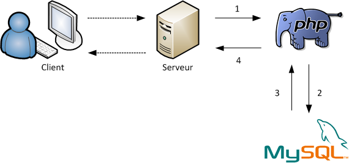

# Récupérer des données à partir de la base de données

Dans cette section, nous allons couvrir la récupération de données à partir d'une base de données MySQL et ce à l'aide de PHP.

>**Astuce :** Le [script de création](../src/exemple-interaction-bd/demo_acces_donnees.sql) de la base de données cible pour la démonstration est disponible. Au besoin, consultez la section À METTRE ICI, pour l'importatation d'une base de données via un script.

## À quel moment mon site web a besoin d'une base de données

Les bases de données peuvent contenir un large éventail d’informations, comme :

- Articles
- Photos
- Vidéos
- Questions
- Réponses
- Les informations d'un usager
- Etc

Si un site web peut fournir un large éventail d’informations, et ce efficacement, il devient beaucoup plus utile qu’une simple page web statique.

Les bases de données sont également utilisées pour stocker la structure des pages Web elles-mêmes, pas seulement le contenu.

Une demande à un site Web se résume ainsi :

- Le serveur reçoit la demande
- Le serveur demande à la logique d'affaires d'analyser la demande
- La logique d'affaires va, au besoin, récupérer de l'information dans la base de données
- Le serveur met le tout ensemble dans une page Web et envoie la page au navigateur.



Ce processus résume ce qu’on appelle le cycle de demande/réponse HTTP. Et cela peut se produire des milliers de fois par minute selon l'achalandage.

C’est pour cette raison que Facebook, Google et autres ont besoin de ces _data center_ avec beaucoup, __beaucoup de serveurs__, de stockage et de connexions haute capacité.

## Récupérer mes premières données

L’instruction SELECT est utilisée pour sélectionner des données à partir d’une ou plusieurs tables :

```sql
SELECT nom_colonne(s)
  FROM nom_table
```

Ou nous pouvons utiliser le caractère __*__ pour sélectionner __TOUTES__ les colonnes à partir d’une table cible :

```sql
SELECT *
  FROM nom_table
```

>**Astuce :** Il est une bonne pratique de préalablement valider notre requête SQL via l'interface de PhpMyAdmin avant d'intégrer celle-ci dans notre code.

### Utiliser PDO et fetchAll() pour récupérer des données

La fonction fetchAll(), retourne un tableau contenant toutes les lignes du jeu d'enregistrements. Le tableau représente chaque ligne comme soit un tableau de valeurs des colonnes, soit un objet avec des propriétés correspondant à chaque nom de colonne.

L'utilisation de cette méthode pour récupérer de gros jeux de résultats peut augmenter les ressources du système, mais également ces ressources. Plutôt que de récupérer toutes les données et de les manipuler avec PHP, utilisez la base de données pour manipuler les jeux de résultats. Par exemple, utilisez les clauses WHERE et ORDER BY dans vos requêtes SQL pour restreindre les résultats avant de les récupérer et de les traiter avec PHP.

L'exemple suivant sélectionne les colonnes _id\_utilisateur_, _prenom_ et _nom_ de la table _utilisateur_ pour ensuite afficher les données :

```php
<?php
$dsn = 'mysql:dbname=demo_acces_donnees;host=localhost';
$utilisateur = 'root';
$motPasse = 'admin123';

try {
    // Instanciation de la connexion
    $dbh = new PDO($dsn, $utilisateur, $motPasse);

    // Définir le mode d'erreur
    $dbh->setAttribute(PDO::ATTR_ERRMODE, PDO::ERRMODE_EXCEPTION);

    // Définir l'encodage
    $dbh->exec('SET CHARACTER SET UTF8');

    // Préparer la requête à exécuter
    $sth = $dbh->prepare("SELECT id_utilisateur, nom, prenom FROM utilisateur;");

    // Exécution de la requête
    $sth->execute();

    // Récupérer tous les utilisateurs provenant de l'exécution de la requête
    $utilisateurs = $sth->fetchAll();

    // Afficher les informations des utilisateurs à l'écran
    echo("<pre>");
    print_r($utilisateurs);
    echo("</pre>");

} catch (PDOException $e) {
    echo('Échec lors de la connexion : ' . $e->getMessage());
}
?>
```

Affichage à l'écran :

```txt
Array
(
    [0] => Array
        (
            [id_utilisateur] => 1
            [0] => 1
            [nom] => Garon-Michaud
            [1] => Garon-Michaud
            [prenom] => Alexis
            [2] => Alexis
        )

    [1] => Array
        (
            [id_utilisateur] => 3
            [0] => 3
            [nom] => Garon-Michaud
            [1] => Garon-Michaud
            [prenom] => Sacha
            [2] => Sacha
        )

    [2] => Array
        (
            [id_utilisateur] => 4
            [0] => 4
            [nom] => Garon-Michaud
            [1] => Garon-Michaud
            [prenom] => François
            [2] => François
        )

    [3] => Array
        (
            [id_utilisateur] => 5
            [0] => 5
            [nom] => Garon-Michaud
            [1] => Garon-Michaud
            [prenom] => Élisabeth
            [2] => Élisabeth
        )

    [4] => Array
        (
            [id_utilisateur] => 6
            [0] => 6
            [nom] => Michaud
            [1] => Michaud
            [prenom] => Laurianne
            [2] => Laurianne
        )

)
```

### Utiliser PDO et fetch() pour récupérer un usager spéficique

La fonction fetch(), récupère une ligne depuis un jeu de résultats associé à l'objet PDOStatement.

La valeur retournée par cette fonction en cas de succès dépend du type récupéré. Dans tous les cas, FALSE est retourné si une erreur survient.

L'exemple suivant sélectionne les colonnes _id\_utilisateur_, _prenom_ et _nom_ de la table _utilisateur_ où la colonne _id\_utilisateur_ est égale à 1, pour ensuite afficher les données :

```php
<?php
$dsn = 'mysql:dbname=demo_acces_donnees;host=localhost';
$utilisateur = 'root';
$motPasse = 'admin123';

try {
    // Instanciation de la connexion
    $dbh = new PDO($dsn, $utilisateur, $motPasse);

    // Définir le mode d'erreur
    $dbh->setAttribute(PDO::ATTR_ERRMODE, PDO::ERRMODE_EXCEPTION);

    // Définir l'encodage
    $dbh->exec('SET CHARACTER SET UTF8');

    // Préparer la requête à exécuter
    $sth = $dbh->prepare("SELECT id_utilisateur, nom, prenom FROM utilisateur WHERE id_utilisateur = 1;");

    // Exécution de la requête
    $sth->execute();

    // Récupérer l'utilisateurs provenant de l'exécution de la requête
    $utilisateur = $sth->fetch();

    // Afficher les informations de l'utilisateur à l'écran
    echo("<pre>");
    print_r($utilisateur);
    echo("</pre>");

} catch (PDOException $e) {
    echo('Échec lors de la connexion : ' . $e->getMessage());
}
?>
```

Affichage à l'écran :

```txt
Array
(
    [id_utilisateur] => 1
    [0] => 1
    [nom] => Garon-Michaud
    [1] => Garon-Michaud
    [prenom] => Alexis
    [2] => Alexis
)
```

## Récupérer des données à partir d'une requête paramétrée


- avec un paramètre
- avec deux paramètres

## Injection SQL

- escape_string
- bind param à cause de https://kinsta.com/fr/blog/injections-sql/ https://www.php.net/manual/fr/pdo.constants.php
- exemple complet pour intégrer dans une page

## Produire une page web avec des données provenant de la base de données


## Références

- <https://www.php.net/manual/fr/pdostatement.fetch.php>
- <https://www.php.net/manual/fr/pdostatement.fetchall.php>

[Revenir à la page principale de la section](README.md)
