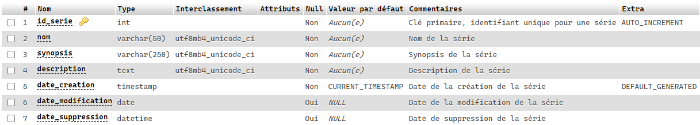

# Supprimer des données de la base de données

La commande __DELETE__ est utilisée pour supprimer les enregistrements existants d’une table de la base de données.

Vous pouvez utiliser la clause WHERE avec la commande DELETE pour préciser les enregistrements à supprimer, sinon tous les enregistrements seront supprimés.

## Syntaxe de base

Examinons la syntaxe de base de la commande DELETE avec une clause WHERE :

```js
DELETE FROM nom_table
[WHERE condition];
```

- __DELETE FROM nom\_table__ - Est la commande qui indique à la base de données la table cible pour la suppression.
- __[WHERE condition]__ - Est facultative et peut être utilisée pour appliquer un filtre qui restreint le nombre de lignes affectées par la suppression.

Lorsqu'on renseigne les valeurs pour dans la clause WHERE, les éléments suivants doivent être pris en considération :

- __Les données de type texte__ - Doivent être incluses dans des guillemets simples.
- __Les données de type numérique__ - Doivent être fournies directement et sans les entourer de guillemets simples ou doubles.
- __Les données de type date__ - Doivent être entre des guillemets simples dans un format tel que 'YYYY-MM-DD'.

>**Note :** Au besoin, référez-vous à la [documentation](https://dev.mysql.com/doc/refman/8.0/en/data-types.html) au sujet des différents types.

## Supprimer ma première donnée

À l'aide de phpMyAdmin, nous allons supprimer notre premier enregistrement. Avant de procéder à la suppression, regardons la structure de la table _serie_.



>**Remarque :** Le champ _id\_serie_ possède l'attribut __[AUTO_INCREMENT](https://dev.mysql.com/doc/refman/8.0/en/example-auto-increment.html)__ pour générer automatiquement un identifiant unique lors de la création d'un nouvel enregistrement.

>**Astuce :** Le [script](../src/exemple-interaction-bd/creation-table-serie.sql) pour la création de la table _serie_ est disponible.

Nous allons procéder à la suppression de la série ayant pour identifiant (_id\_serie_) la valeur de __3__ :

```sql
DELETE FROM serie
 WHERE id_serie = 3;
```


## Supprimer une donnée avec PHP à l'aide de PDO

Cette fois, nous allons procéder à la suppression d'une série, mais à partir de PHP avec PDO.

```php
<?php
$dsn = 'mysql:dbname=demo_acces_donnees;host=localhost';
$utilisateur = 'root';
$motPasse = 'admin123';

try {
    // Créer la connexion
    $dbh = new PDO($dsn, $utilisateur, $motPasse);
    $dbh->setAttribute(PDO::ATTR_ERRMODE, PDO::ERRMODE_EXCEPTION);
    $dbh->exec('SET CHARACTER SET UTF8');

    $idSerie = 3;

    // Requête DELETE pour la suppression d'une série
    $requeteSupprimerSerie = "DELETE FROM serie WHERE id_serie = :id_serie";

    $sth = $dbh->prepare($requeteSupprimerSerie);

    $sth->bindParam(':id_serie', $idSerie, PDO::PARAM_INT);
    $sth->execute();

} catch (PDOException $e) {
    echo('Échec lors de la connexion : ' . $e->getMessage());
}
?>
```

À l'aide de phpMyAdmin, il est possible de confirmer la mise à jour de la série :


Au besoin, référez-vous à la [documentation officielle](https://dev.mysql.com/doc/refman/8.0/en/delete.html).

[Revenir à la page principale de la section](README.md)
