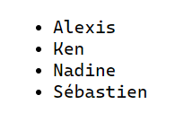

# Générer du HTML à l'aide de PHP

PHP est un langage de programmation côté serveur (_backend_). Une de ses fonctions primaires est la construction d'une page Web, ceci consiste à générer des balises HTML qui composent la page et qu'il enverra le tout au client (au navigateur).

## Affichage simple avec la commande _echo_

La commande _echo_ sert à afficher du contenu texte, ce texte doit être placé entre des guillemets.

```php
echo("Voici la commande echo");
```

ou bien avec des apostrophes

```php
echo('Voici la commande echo');
```

L'affichage :

```txt
Voici la commande echo
```

Il est également possible d'afficher un nombre, dans ce cas l'utilisation de guillemets n'est pas nécessaire.

```php
echo(2020);
```

L'affichage :

```txt
2020
```

## Afficher du HTML à l'aide de la commande _echo_

À l'aide de la commande _echo_, il est possible de produire du HTML.

```php
echo("<h3>Titre simple</h3><p>Bacon ipsum</p>");
```

L'affichage :

__Titre simple__

Bacon ipsum

## Caractère d'échappement

Si vous avez un contenu texte à afficher avec des guillemets, ceux-ci peuvent être confondus avec les guillemets de début et de fin.

```php
echo("Mon ami "Bruno" est gentil.");
```

>**Note :** Le code précédent causera une erreur.

Pour corriger ce problème, il suffit de mettre un caractère d'échappement (le symbole __\\__).

```php
echo("Mon ami \"Bruno\" est gentil.");
```

Affichage :

```txt
Mon ami "Bruno" est gentil.
```

Ce problème peut se produire également lors de l'utilisation d'apostrophes.

```php
echo('Mon ami 'Bruno' est gentil.');
```

>**Note :** Le code précédent causera une erreur.

La solution à suivre est là même que lorsque l'on utilise les guillemets, il faut utiliser un caractère d'échappement (symbole __\\__).

```php
echo('Mon ami \'Bruno\' est gentil.');
```

Affichage :

```txt
Mon ami 'Bruno' est gentil.
```

## Utilisation des apostrophes

Si votre contenu correspond à du code HTML, plutôt que d’échapper tous les guillemets, vous pouvez délimiter le contenu par des apostrophes.

```php
echo('<a id="lien" href="#" title="infobulle"> lien </a>');
```

## Version courte de la commande _echo_

Depuis quelques versions, la commande _echo_ possède une version courte. Cette version courte est utile dans un document HTML. __<?="ma valeur"?>__

Code PHP :

```php
$nom = "Louna";
```

Code HTML :

```php
<p>Le nom de mon chien est <?=$nom?>.</p>
```

Affichage :

```txt
Le nom de mon chien est Louna.
```

## Génération complexe de HTML

Il est possible de générer des éléments HTML plus complexes.

Créons une liste de prénoms avec une balise __\<ul\>__ et des balises __\<li\>__.

```php
<!DOCTYPE html>
<html lang="en">
<head>
    <meta charset="UTF-8">
    <meta name="viewport" content="width=device-width, initial-scale=1.0">
    <title>Démonstration de la création d'une liste</title>
</head>
<body>
<?php
$prenoms = ["Alexis", "Ken", "Nadine", "Sébastien"];
?>

<ul>
    <?php
        foreach ($prenoms as $prenom) {
            echo('<li>'.$prenom.'</li>');
        }
    ?>
</ul>
</body>
</html>
```

Affichage :



>**Astuce :** Le [code source](../src/exemple-interpretation-php/exemple-afficher-liste.php) est disponible.

[Revenir à la page principale de la section](README.md)
