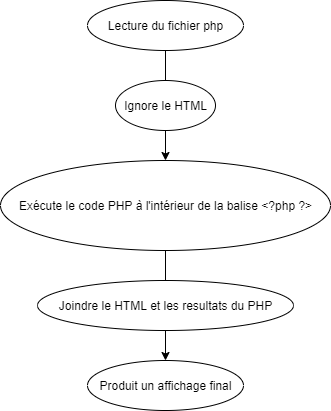
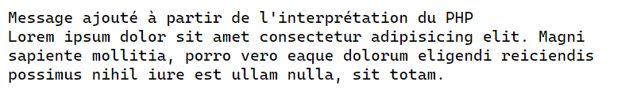

# Inclure du PHP dans une page HTML

Le code PHP peut s’ajouter n’importe où dans une page HTML, il suffit à chaque fois d’ouvrir la balise d’ouverture et de fermeture PHP à différents endroits de la page HTML.

## Processus d'interprétation d'une page PHP

L'interpréteur lit un fichier source avec l'extension __.php__ puis génère un flux de sortie avec les règles suivantes :

- Toute ligne située à l’extérieur d’un bloc PHP __(entre \<?php et ?\>)__ est recopiée et inchangée dans le flux de sortie.
- Le code PHP est interprété et génère éventuellement des résultats intégrés eux aussi au flux de sortie.
- Les erreurs éventuelles donnent lieu à des messages d’erreurs qu’on retrouve également
dans le flux de sortie (__selon la configuration du serveur__).
- Une __page HTML pure__ sauvegardée avec l’extension .php sera donc non modifiée et renvoyée telle quelle par le serveur.



## Exemple de l'interprétation

```php
<!DOCTYPE html>
<html lang="en">
<head>
    <meta charset="UTF-8">
    <meta name="viewport" content="width=device-width, initial-scale=1.0">
    <title>Exemple du processus d'interprétation d'une page PHP</title>
</head>
<body>
    <?php
        // Ceci est une ligne de commentaire ignorée lors de l'interprétation
        echo("Message ajouté à partir de l'interprétation du PHP")
    ?>

    <!-- Les commentaires sont ignorés et le HTML renvoyé tel quel. -->
    <div>Lorem ipsum dolor sit amet consectetur adipisicing elit. Magni sapiente mollitia, porro vero eaque dolorum eligendi reiciendis possimus nihil iure est ullam nulla, sit totam.</div>
</body>
</html>
```

>**Astuce :** Le [code source](../src/exemple-interpretation-php/index.php) est disponible.

Voici la page web qui sera produite suite à l'interprétation.



Notez que :

- Les commentaires sont ignorés (ceux en PHP et ceux en HTML).
- Le code à l'intérieur de la balise __<\?php ?\>__ est interprété et le message résultant de la commande __echo__ est ajouté à la page.

[Revenir à la page principale de la section](README.md)
