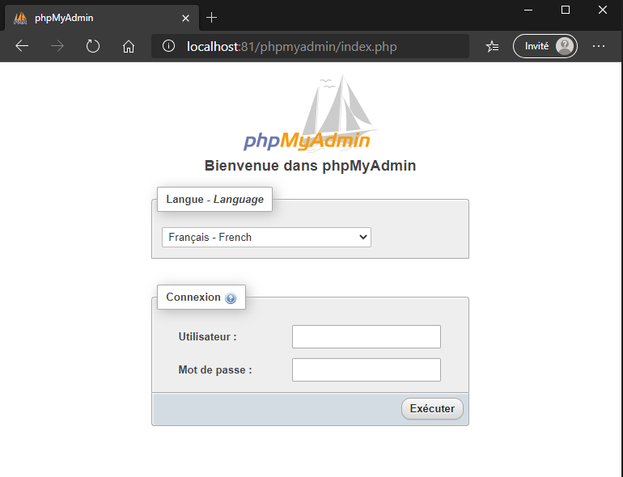

# phpMyAdmin

phpMyAdmin est un outil logiciel libre écrit en PHP qui est destiné à gérer l’administration d’un serveur de base de données [MySQL](https://www.mysql.com/fr/) ou [MariaDB](https://mariadb.org/). Vous pouvez utiliser phpMyAdmin pour effectuer la plupart des tâches administratives, y compris la création d’une base de données, l’exécution de requêtes et l’ajout de comptes d’utilisateurs.

>**Notez bien que** - MySQL sera la base de données utilisée.

## Fonctionnalités prises en charge

Actuellement phpMyAdmin peut :

- créer, parcourir, modifier et déposer des bases de données, des tables, des vues, des colonnes et des index
- afficher plusieurs ensembles de résultats par le biais de procédures ou de requêtes
- créer, copier, déposer, renommer et modifier des bases de données, des tables, des colonnes et des index
- charger des fichiers texte dans des tables
- créer et lire des décharges de tables
- exportation de données à différents formats
- ajouter, modifier et supprimer les comptes et privilèges utilisateur MySQL
- vérifier l’intégrité référentielle dans les tables
- suivre les modifications apportées aux bases de données, aux tableaux et aux vues
- créer, modifier, appeler, exporter et abandonner les procédures et fonctions stockées
- créer, modifier, exporter et déposer des événements et des déclencheurs
- autres...

## Accéder à l'interface

L'interface phpMyAdmin est accessible via un navigateur web.

Vous pouvez vous connecter à l'interface de phpMyAdmin depuis votre ordinateur (s'il est configuré comme un serveur) ou d'un ordinateur distant (serveur de réseau local ou serveur web). Les serveurs fournissant le service de phpMyAdmin exécutent localement le gestionnaire de base de données
MySQL, un serveur web (par exemple Apache), puis phpMyAdmin. Une combinaison de ces logiciels est fournie dans certains regroupements de logiciels comme [WAMP](https://bitnami.com/stack/wamp) sous Windows.

Pour accéder à l'interface de phpMyAdmin, il faut accéder à l'adresse désignée dans un navigateur (il faut parfois utiliser un mot de passe).

L'adresse par défaut lors de l'installation de WAMP est <http://localhost/phpmyadmin/index.php>. Notez bien que le [port](https://fr.wikipedia.org/wiki/Liste_de_ports_logiciels) peut être différent.

## Importation et exportation

Au besoin, référez-vous à la [documentation](https://docs.phpmyadmin.net/fr/latest/import_export.html).

## Gestion des utilisateurs

Au besoin, référez-vous à la [documentation](https://docs.phpmyadmin.net/fr/latest/privileges.html).

## Références

- <https://docs.phpmyadmin.net>

[Revenir à la page principale](../README.md)
