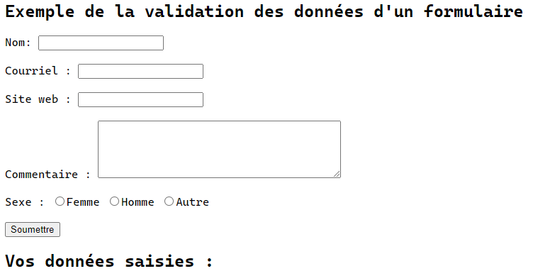

# Validation des données

Dans ce module, nous allons expérimenter quelques techniques pour la validation des données.

> :warning: **À garder en tête :** Les exemples sont banalisés et dénudés de bonnes pratiques d'architecture pour en simplifier l'affichage.

## Les super variables globales

Les super variables globales sont des variables intégrées qui sont __toujours disponibles dans toutes les portés__.

### La super variable globale $_GET

La super variable globale $\_GET est un tableau associatif des valeurs passées au script courant via les paramètres d'URL aussi connue sous le nom de [_query string_](https://en.wikipedia.org/wiki/Query_string). Notez que ce tableau n'est pas seulement rempli pour les requêtes GET, mais plutôt pour toutes les requêtes avec un _query string_.

### La super variable globale $_POST

La super variable globale $\_POST est un tableau associatif des valeurs passées au script courant via le protocole HTTP et la méthode POST lors de l'utilisation de la chaîne application/x-www-form-urlencoded ou multipart/form-data comme en-tête HTTP [Content-Type](https://developer.mozilla.org/fr/docs/Web/HTTP/Headers/Content-Type) dans la requête.

## La différence entre GET et POST

Un navigateur communique avec un serveur en utilisant généralement l’une des deux méthodes HTTP([_Hypertext Transfer Protocol_](https://fr.wikipedia.org/wiki/Hypertext_Transfer_Protocol)), soient les méthodes GET et POST. Ces deux méthodes transmettent l’information différemment et ont des avantages et des inconvénients différents.

>**Note :** Au besoin, référez-vous à cet [article](https://www.diffen.com/difference/GET-vs-POST-HTTP-Requests).

### La méthode GET

Avec la méthode GET, les données sont envoyées sous forme de paramètres dans l'URL qui sont généralement des paires de clés valeurs séparées par des esperluettes.

Une URL avec des données GET ressemblera à :

```txt
http://www.pewpew.com/pewpew.php?prenom=alexis&age=28
```

Le __prenom__ et l'__âge__ dans l’URL correspondent à des paramètres de la requête HTTP GET. La valeur d'un paramètre correspond à la valeur suivant le "=". De plus, il est possible d'ajouter des paramètres en séparant les valeurs avec des esperluettes. On ne peut qu'envoyer des données textuelles simples.

### Avantages et inconvénients de l’utilisation de la méthode GET

- Étant donné que les données envoyées par la méthode GET sont affichées en claire dans l’URL, il est possible de créer un favori de la page avec des valeurs spécifiques.
- La méthode GET __n’est pas adaptée pour transmettre des informations sensibles__ telles que le nom d’un utilisateur et son mot de passe, car ces données sont entièrement visibles dans l'URL.
- La longueur d'un URL est limitée. Il y a donc une limitation pour l’envoi total des données.

On se souvient que PHP fournit la super variable globale $_GET pour accéder à toutes les informations envoyées par l’URL ou soumises via un formulaire HTML en précisant la méthode "GET".

Par exemple :

```php
<!DOCTYPE html>
<html lang="fr">
<head>
    <title>Exemple simple de l'utilisation de la méthode GET</title>
</head>
<body>
<?php
if(isset($_GET["nom"])){
    echo("<p>Bonjour, " . htmlspecialchars($_GET["nom"]) . "</p>");
}
?>
<form method="get" action="<?=htmlspecialchars($_SERVER["PHP_SELF"])?>">
    <label for="champNom">Nom :</label>
    <input type="text" name="nom" id="champNom">
    <input type="submit" value="Soumettre">
</form>
</body>
```

### La méthode POST

Avec la méthode POST, les données sont envoyées au serveur sous forme de [paquet](https://fr.wikipedia.org/wiki/Commutation_de_paquets) dans une communication séparée du script de traitement. Les données envoyées par la méthode POST ne seront pas visibles dans l’URL.

### Avantages et inconvénients de l’utilisation de la méthode POST

- La méthode POST est plus sécuritaire que la méthode GET parce que les informations saisies par l’utilisateur ne sont jamais visibles dans l'URL ou dans les journaux du serveur.
- La méthode POST possède une limite de transfert beaucoup plus grande que la méthode GET. En plus de pouvoir transmettre des données textuelles, il est également possible de transmettre des données binaires comme un fichier (téléchargement d’un fichier).
- Étant donné que les données envoyées par la méthode POST ne sont pas visibles dans l’URL, il n’est donc pas possible de créer un favori de la page avec des valeurs spécifiques.

On se souvient que PHP fournit une autre super variable globale pour accéder à toutes les informations envoyées par la méthode POST ou soumises par le biais d’un formulaire HTML en précisant la méthode "POST".

Par exemple :

```php
<!DOCTYPE html>
<html lang="fr">
<head>
    <title>Exemple simple de l'utilisation de la méthode POST</title>
</head>
<body>
<?php
if(isset($_POST["nom"])){
    echo("<p>Bonjour, " . htmlspecialchars($_POST["nom"]) . "</p>");
}
?>
<form method="post" action="<?=htmlspecialchars($_SERVER["PHP_SELF"])?>">
    <label for="champNom">Nom :</label>
    <input type="text" name="nom" id="champNom">
    <input type="submit" value="Soumettre">
</form>
</body>
```

## Valider les données provenant d'un formulaire HTML

Dans cette section, nous allons procéder à la validation des données provenant d'un formulaire HTML.

> :warning: **À garder en tête :** Il est crucial de se soucier de la sécurité lors du traitement des formulaires en PHP. Une validation adéquate des données d'un formulaire est importante pour protéger votre formulaire contre les pirates informatiques et les pourrielleurs!

Regardons de plus près le formulaire HTML avec lequel nous allons travailler. Celui-ci possède divers champs d’entrée tels que des champs de texte obligatoires et facultatifs, des boutons radio et d'un bouton pour la soumission du formulaire :



Les règles de validation du formulaire ci-dessus sont les suivantes :

| Champ | Règles de validation |
|---|---|
| Nom | Obligatoire et peut seulement contenir des lettres, des tirets, des apostrophes et des espaces blancs |
| Courriel | Obligatoire et doit contenir une adresse courriel valide |
| Site web | Optionnel et si présent, doit contenir une adresse URL valide |
| Commentaire | Optionnel et est un champ de saisie sur plusieurs lignes |
| Sexe | Obligatoire, au moins un sexe doit être sélectionné |

Tout d’abord, regardons le code HTML du formulaire :

```php
<form method="post" action="<?=htmlspecialchars($_SERVER["PHP_SELF"])?>">  
  Nom: <input type="text" name="nom">
  <br><br>
  Courriel : <input type="text" name="courriel">
  <br><br>
  Site web : <input type="text" name="siteWeb">
  <br><br>
  Commentaire : <textarea name="commentaire" rows="5" cols="40"></textarea>
  <br><br>
  Sexe :
  <input type="radio" name="sexe" value="femme">Femme
  <input type="radio" name="sexe" value="homme">Homme
  <input type="radio" name="sexe" value="autre">Autre
  <br><br>
  <input type="submit" name="submit" value="Soumettre">  
</form>
```

>**À noter :** le formulaire est dépourvu d'attribut __required__. La validation des champs obligatoires sera effectuée côté serveur (PHP).

### L’élément de formulaire

Regardons de plus près la balise "form".

```php
<form method="post" action="<?=htmlspecialchars($_SERVER["PHP_SELF"])?>">  
```

Lorsque le formulaire est soumis, les données du formulaire sont envoyées par la méthode POST.

>**Qu'est-ce que la variable $_SERVER["PHP_SELF"]? :** $_SERVER["PHP_SELF"] une super variable globale qui renvoie le nom de fichier du script actuellement en cours d’exécution.

Ainsi, le $_SERVER["PHP_SELF"] envoie les données du formulaire soumises à la page elle-même, au lieu de sauter à une page différente. De cette façon, l’utilisateur recevra des messages d’erreur sur la même page que le formulaire.

>**Qu'est-ce que la fonction htmlspecialchars()? :** La fonction htmlspecialchars () convertit des caractères spéciaux en entités
HTML. Cela signifie qu’il remplacera les caractères HTML comme < et > avec &lt; et &gt;. Cela empêche les attaquants d’exploiter le code en injectant du code HTML ou JavaScript (attaques de type [_cross-site scripting_](https://fr.wikipedia.org/wiki/Cross-site_scripting)(XSS)).

### Note sur la sécurité d'un formulaire en PHP

__La variable $_SERVER["PHP_SELF"] peut être utilisée par les pirates informatiques!__

Si on utilise PHP\_SELF dans notre page, un utilisateur peut entrer une barre oblique (/) puis des commandes de _cross-site scripting_ à exécuter.

>**Le cross-site scripting (XSS) :** est un type de vulnérabilité que l’on retrouve généralement dans les applications Web. Une attaque de type _cross-site scripting_ permet aux attaquants d’injecter du script côté client dans les pages Web consultées par d’autres utilisateurs.

Supposons que nous avons le formulaire suivant dans une page nommée "test.php" :

```php
<form method="post" action="<?php echo $_SERVER["PHP_SELF"];?>">
```

À présent, si un utilisateur entre l’URL de base dans la barre d’adresse comme suite : "http://www.pewpew.com/test.php", le code ci-dessus sera traduit à :

```php
<form method="post" action="test.php">
```

Jusqu'à maintenant, ce n'est pas un problème.

Néanmoins, considérons qu’un utilisateur entre l’URL suivante dans la barre d’adresse :

```txt
http://www.pewpew.com/test.php/%22%3E%3Cscript%3Ealert('hacked')%3C/script%3E
```

Dans ce cas, le code ci-dessus sera traduit à :

```php
<form method="post" action="test.php/"><script>alert('hacked')</script>
```

Ce code ajoute une balise de script et une commande d’alerte. Et lorsque la page se charge, le code JavaScript sera exécuté et l’utilisateur verra une boîte d’alerte. __Ce n’est qu’un exemple simple et inoffensif de la façon dont PHP\_SELF variable peut être exploitée__.

### Comment éviter les exploits lors de l'utilisation de la variable $_SERVER["PHP_SELF"]

Les exploits $_SERVER["PHP_SELF"] peuvent être évités en utilisant la fonction htmlspecialchars().

Le code de formulaire devrait ressembler à ceci :

```php
<form method="post" action="<?=htmlspecialchars($_SERVER["PHP_SELF"])?>">
```

La fonction [htmlspecialchars()](https://www.php.net/manual/fr/function.htmlspecialchars.php) convertit des caractères spéciaux en entités HTML. Donc, si l’utilisateur essaie d’exploiter la variable $_SERVER["PHP_SELF"], la sortie en résultera de la manière suivante :

```html
<form method="post" action="test.php/&quot;&gt;&lt;script&gt;alert('hacked')&lt;/script&gt;">
```

On est sauf! La tentative a échoué et aucun mal n’est fait!

### Valider les données d'un formulaire avec PHP

La première chose que nous allons faire est de passer toutes les variables à travers la fonction htmlspecialchars().

Lorsque nous utilisons la fonction htmlspecialchars(), si un utilisateur essaie de soumettre ce qui suit dans un champ de saisi :

```html
<script>location.href ('http://www.pewpew.com')</script>
```

Ce code JavaScript ne serait pas exécuté, car il serait renvoyé sous forme de HTML échappé, comme ceci :

```html
&lt;script&gt;location.href ('http://www.pewpew.com')&lt;/script&gt;
```

Le code est maintenant sûr d’être affiché sur une page Web ou à l’intérieur d’un courriel.

Nous ferons deux autres actions lorsque l’utilisateur soumettra le formulaire :

- Retirer les caractères inutiles (espace supplémentaire, tabulation, nouvelle ligne) des données d’entrée de l’utilisateur avec la fonction [trim()](https://www.php.net/manual/fr/function.trim.php) de PHP.
- Supprimer les barreaux obliques inverses (_backslashes_ - \\) des données d’entrée de l’utilisateur avec la fonction [stripslashes()](https://www.php.net/manual/fr/function.stripslashes.php) de PHP.

La prochaine étape est de créer une fonction qui enchaînera ces diverses vérifications, nommons celle-ci validerEntree().

Maintenant, nous pouvons vérifier chacune des variables présentes dans la variable $_POST avec la fonction validerEntree() et le script PHP ressemble à ceci:

```php
<?php
// Créer les variables avec une valeur vide

$nom = "";
$courriel = "";
$siteWeb = "";
$commentaire = "";
$genre = "";


if ($_SERVER["REQUEST_METHOD"] == "POST") {
  $nom = validerEntree($_POST["nom"]);
  $courriel = validerEntree($_POST["courriel"]);
  $siteWeb = validerEntree($_POST["siteWeb"]);
  $commentaire = validerEntree($_POST["commentaire"]);
  $sexe = validerEntree($_POST["sexe"]);
}

function validerEntree($donnee) {
  $donnee = trim($donnee);
  $donnee = stripslashes($donnee);
  $donnee = htmlspecialchars($donnee);
  return $donnee;
}
?>
```

Notez qu’au début du script, on vérifie si le formulaire a été soumis à l’aide de $_SERVER["REQUEST_METHOD"]. Si le [REQUEST\_METHOD](https://www.php.net/manual/fr/reserved.variables.server.php) est POST, alors le formulaire a été soumis et il doit être validé. S’il n’a pas été soumis, sautez la validation et affichez un formulaire vierge.

Toutefois, dans l’exemple ci-dessus, tous les champs d’entrée sont facultatifs. Le script fonctionne très bien même si l’utilisateur n’entre aucune donnée.

La prochaine étape consiste à programmer les champs d’entrée obligatoires et à créer des messages d’erreur si nécessaire.

>**Astuce :** Le [code source](../src/validation-parametres/exemple-validation-formulaire-sans-champs-requis.php) est disponible.

### Validation des champs requis

À partir du tableau des règles de validation plus haut, on se souvient que les champs "Nom", "Courriel" et "Sexe" sont obligatoires. Ces champs ne peuvent pas être vides et doivent être remplis dans le formulaire HTML.

Dans le code suivant, on ajoute de nouvelles variables : $messageErreurNom, $messageErreurCourriel et $messageErreurSexe. Ces variables vont contenir les messages d’erreur pour les champs requis. On ajoute également une condition pour chaque variable contenu dans la variable $_POST. Donc, on vérifie si la variable $_POST contient une valeur vide avec la fonction [empty()](https://www.php.net/manual/fr/function.empty.php) de PHP. Si la valeur est vide, un message d’erreur est conservé dans les différentes variables d’erreur et si elle n’est pas vide, on envoie les données d’entrée de l’utilisateur à travers la fonction validerEntree() :

```php
<?php
// Créer les variables avec une valeur vide
$nom = "";
$courriel = "";
$siteWeb = "";
$commentaire = "";
$sexe = "";

// Créer les variables pour les messages d'erreur
$messageErreurNom = "";
$messageErreurCourriel = "";
$messageErreurSexe = "";

if ($_SERVER["REQUEST_METHOD"] == "POST") {
  $nom = validerEntree($_POST["nom"]);
  $courriel = validerEntree($_POST["courriel"]);
  $siteWeb = validerEntree($_POST["siteWeb"]);
  $commentaire = validerEntree($_POST["commentaire"]);
  $sexe = validerEntree($_POST["sexe"]);
}

if ($_SERVER["REQUEST_METHOD"] == "POST") {
  if (empty($_POST["nom"])) {
    $messageErreurNom = "Le nom est obligatoire.";
  } else {
    $nom = validerEntree($_POST["nom"]);
  }
  
  if (empty($_POST["courriel"])) {
    $messageErreurCourriel = "Le courriel est obligatoire.";
  } else {
    $courriel = validerEntree($_POST["courriel"]);
  }
    
  if (!empty($_POST["siteWeb"])) {
    $siteWeb = validerEntree($_POST["siteWeb"]);
  }

  if (!empty($_POST["commentaire"])) {
    $commentaire = validerEntree($_POST["commentaire"]);
  }

  if (empty($_POST["sexe"])) {
    $messageErreurSexe = "Le sexe est obligatoire.";
  } else {
    $sexe = validerEntree($_POST["sexe"]);
  }
}

function validerEntree($donnee) {
  $donnee = trim($donnee);
  $donnee = stripslashes($donnee);
  $donnee = htmlspecialchars($donnee);
  return $donnee;
}
?>
```

### Afficher les messages d’erreur

Ensuite, dans le formulaire HTML, on ajoute une balise après chaque champ requis qui permet d'afficher le message d’erreur correct lorsque nécessaire, c’est-à-dire si l’utilisateur essaie de soumettre le formulaire sans remplir les champs requis :

```php
<h2>Exemple de la validation des données d'un formulaire avec les champs requis</h2>
<p><span class="error">* champs obligatoires</span></p>
<form method="post" action="<?=htmlspecialchars($_SERVER["PHP_SELF"])?>">  
  Nom: <input type="text" name="nom">
  <span class="error">* <?=$messageErreurNom?></span>
  <br><br>
  Courriel : <input type="text" name="courriel">
  <span class="error">* <?=$messageErreurCourriel?></span>
  <br><br>
  Site Web : <input type="text" name="siteWeb">
  <br><br>
  Commentaire : <textarea name="commentaire" rows="5" cols="40"></textarea>
  <br><br>
  Sexe :
  <input type="radio" name="sexe" value="femme">Femme
  <input type="radio" name="sexe" value="homme">Homme
  <input type="radio" name="sexe" value="autre">Autre
  <span class="error">* <?=$messageErreurSexe?></span>
  <br><br>
  <input type="submit" name="submit" value="Soumettre">  
</form>
```

L’étape suivante consiste à valider les données d’entrée, c’est-à-dire est-ce que le champ __Nom__ ne contient-il que des lettres, des tirets, des apostrophes et des espaces blancs? Est-ce que le champ __Courriel__ est rempli et contient une adresse courriel valide? Est-ce que le champ __Site Web__ contient une URL valide?

>**Astuce :** Le [code source](../src/validation-parametres/exemple-validation-formulaire-avec-champs-requis.php) est disponible.

### Validations du nom, de l'adresse courriel et de l'URL du site Web

#### Valider le nom

Le code ci-dessous montre un moyen de vérifier si le champ __Nom__ ne contient que des lettres, des tirets, des apostrophes et des espaces blancs. Si la valeur du champ __Nom__ est invalide, on affiche un message d’erreur :

```php
<?php
if (!preg_match("/^[a-zA-Z-' ]*$/", $nom)) {
  echo("Seuls des lettres, des tirets, des apostrophes et des espaces blancs sont autorisés.");
}
?>
```

La fonction [preg_match()](https://www.php.net/manual/fr/function.preg-match.php) recherche un modèle dans une chaîne et retourne vrai si le modèle existe, sinon retourne faux.

#### Valider l’adresse courriel

La façon la plus simple et la plus sûre de vérifier si une adresse courriel est bien formée est d’utiliser la fonction [filter_var()](https://www.php.net/manual/fr/function.filter-var.php) de PHP.

Dans le code ci-dessous, si l’adresse courriel ne possède pas un format valide, on affiche un message d’erreur :

```php
<?php
if (!filter_var($courriel, FILTER_VALIDATE_EMAIL)) {
  echo("Le format du courriel est invalide.");
}
?>
```

#### Valider l’URL du site Web

Le code ci-dessous montre un moyen de vérifier si l’adresse URL est d'un format valide. Si le format de l’adresse URL n’est pas valide, on affiche un message d'erreur :

```php
<?php
if (filter_var($siteWeb, FILTER_VALIDATE_URL)) {
  echo("Le format de l'adresse URL n'est pas valide.");
}
?>
```

#### Code avec les validations

Maintenant, le script ressemble à ceci :

```php
<?php
// Créer les variables avec une valeur vide
$nom = "";
$courriel = "";
$siteWeb = "";
$commentaire = "";
$sexe = "";

// Créer les variables pour les messages d'erreur
$messageErreurNom = "";
$messageErreurCourriel = "";
$messageErreurSiteWeb = "";
$messageErreurSexe = "";

if ($_SERVER["REQUEST_METHOD"] == "POST") {
  $nom = validerEntree($_POST["nom"]);
  $courriel = validerEntree($_POST["courriel"]);
  $siteWeb = validerEntree($_POST["siteWeb"]);
  $commentaire = validerEntree($_POST["commentaire"]);
  $sexe = validerEntree($_POST["sexe"]);
}

if ($_SERVER["REQUEST_METHOD"] == "POST") {

  if (empty($_POST["nom"])) {
    $messageErreurNom = "Le nom est obligatoire.";
  } else {
    $nom = validerEntree($_POST["nom"]);

    if (!preg_match("/^[a-zA-Z-' ]*$/", $nom)) {
      $messageErreurNom = "Seuls des lettres, des tirets, des apostrophes et des espaces blancs sont autorisés.";
    }
  }

  if (empty($_POST["courriel"])) {
    $messageErreurCourriel = "Le courriel est obligatoire.";
  } else {
    $courriel = validerEntree($_POST["courriel"]);

    if (!filter_var($courriel, FILTER_VALIDATE_EMAIL)) {
      $messageErreurCourriel = "Le format du courriel est invalide.";
    }
  }

  if (!empty($_POST["siteWeb"])) {
    $siteWeb = validerEntree($_POST["siteWeb"]);

    if (filter_var($siteWeb, FILTER_VALIDATE_URL)) {
      $messageErreurSiteWeb = "Le format de l'adresse URL n'est pas valide.";
    }
  }

  if (!empty($_POST["commentaire"])) {
    $commentaire = validerEntree($_POST["commentaire"]);
  }

  if (empty($_POST["sexe"])) {
    $messageErreurSexe = "Le sexe est obligatoire.";
  } else {
    $sexe = validerEntree($_POST["sexe"]);
  }
}
```

>**Astuce :** Le [code source](../src/validation-parametres/exemple-validation-formulaire-avec-validation-format.php) est disponible.

## Références

- <https://www.w3schools.com/php/php_superglobals_get.asp>
- <https://www.w3schools.com/php/php_superglobals_post.asp>
- <https://www.w3schools.com/tags/ref_httpmethods.asp>
- <https://www.w3schools.com/php/php_forms.asp>
- <https://www.w3schools.com/php/php_form_validation.asp#:~:text=What%20is%20the%20%24_SERVER,jumping%20to%20a%20different%20page.>

[Revenir à la page principale de la section](README.md)
